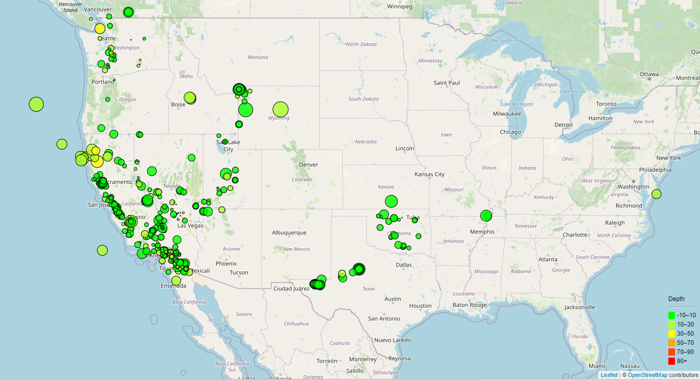
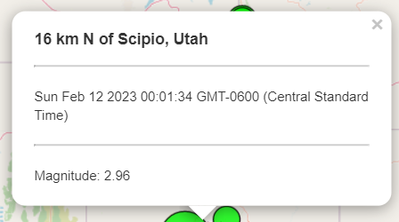
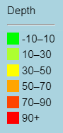

# leaflet-challenge
## Module 15 Challenge
For this project 

## Creating Earthquake Visualization
Using Leaflet I created a map that plots all the earthquakes from the dataset based on their longitude and latitude. The data markers reflect the magnitude of the earthquake by their size and the depth of the earthquake by their color. 

Earthquakes with higher magnitudes appear larger, and earthquakes with greater depth appear darker in color.

## Popups
Each marker has a popup that provides additional information about the earthquake when clicked on.

In this popup you can see where the earthquake took place, the time it took place, as well as the earthquake's magnitude. 

## Legend
A legend is displayed at the bottom right corner of the map to indicate the different depths of the earthquakes and which colors are representing them. 

